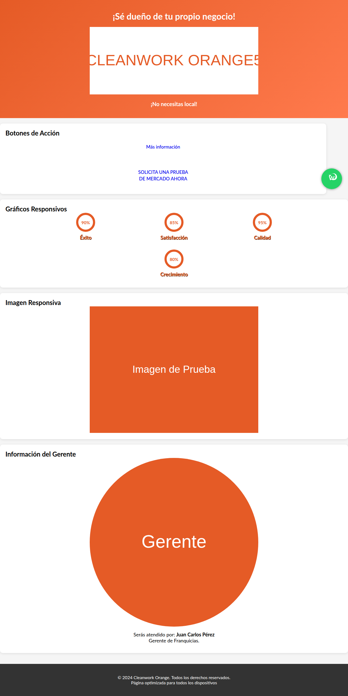
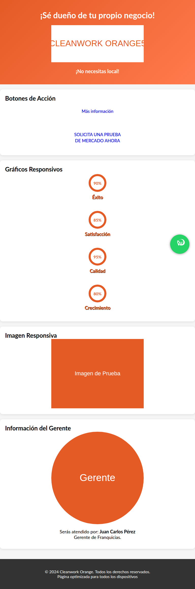
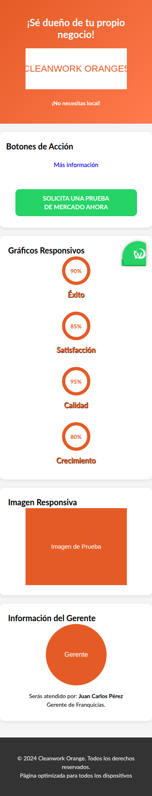

# Responsive Design Screenshots

This folder contains screenshots demonstrating the responsive design implementation:

## Desktop View (1920x1080)

## Tablet View (768x1024) 

## Mobile View (375x667)

## Key Responsive Features Implemented:

### ✅ Mobile-First Design
- Optimized for touch interactions
- 44px minimum touch targets
- Flexible layouts using CSS Flexbox
- Progressive enhancement for larger screens

### ✅ Comprehensive Breakpoints
- **Mobile**: ≤575.98px
- **Large Mobile**: 576px-767.98px  
- **Tablet**: 768px-991.98px
- **Desktop**: 992px-1199.98px
- **Large Desktop**: ≥1200px

### ✅ Interactive Elements
- Responsive buttons that adapt to screen size
- Touch-friendly WhatsApp integration
- Optimized forms and input fields
- Hover effects optimized for different devices

### ✅ Content Optimization
- Responsive images with proper scaling
- Typography that scales appropriately
- Flexible grid layouts for charts and statistics
- Optimized spacing and margins

### ✅ Performance Considerations
- Organized CSS architecture
- Minimal, surgical code changes
- Maintained existing functionality
- Clean, maintainable code structure